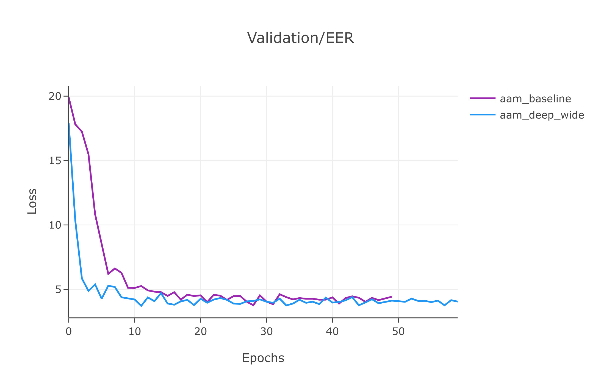
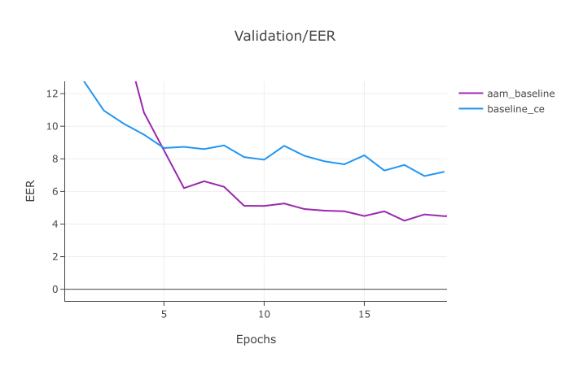
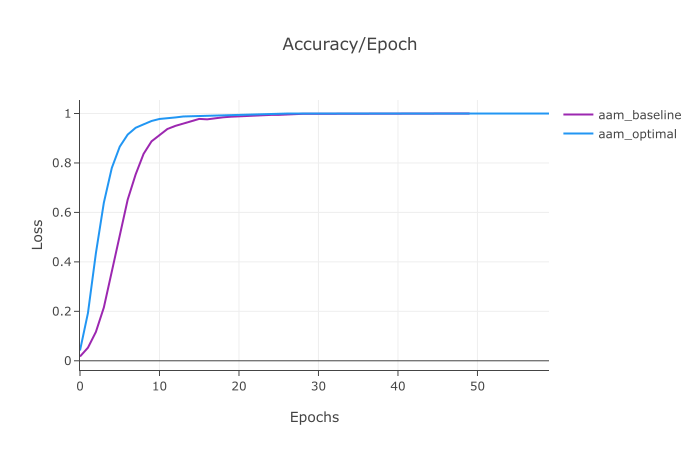
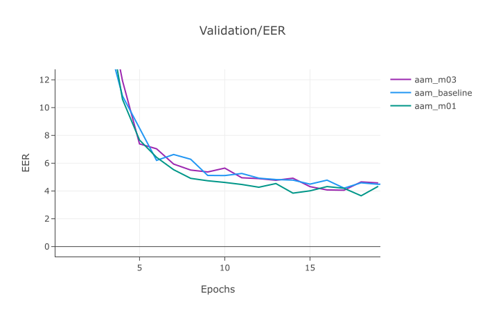
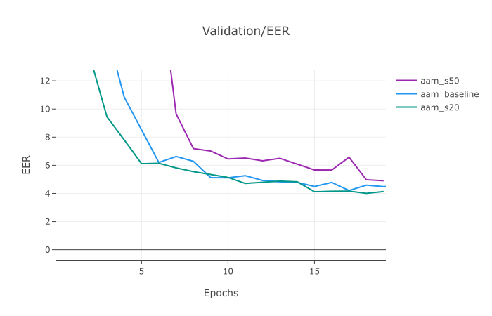
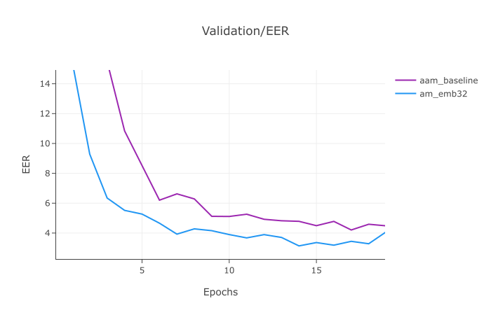
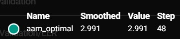
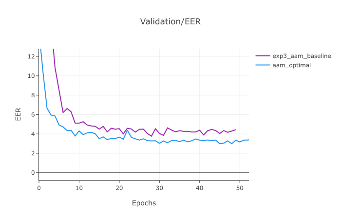

# Отчёт по домашнему заданию.

## 1. Постановка задачи

В задании нужно было решить задачу распознавания говорящего по аудиосегментам речи посредсвом обучения conformer с помощью нового лосса: AAM softmax, и проверить улучшение на расчете метрики Equal Error Rate.


## 2. Angular Margin Softmax (AAM-Softmax)

В данной работе реализован модуль `AngularMarginSoftmax`, который используется в качестве функции потерь для обучения эмбеддингов.

Основная идея:

- и входные эмбеддинги, и веса классов нормируются по L2-норме и интерпретируются как точки на единичной сфере;
- логит для каждого класса зависит от угла между эмбеддингом и вектором класса:  
  $ \cos(\theta_j) = \frac{\langle x, W_j \rangle}{\|x\| \cdot \|W_j\|} $
- для правильного класса \(y\) применяется добавочный угловой отступ \(m\):  
  
  $\cos(\theta_y) \longrightarrow \cos(\theta_y + m)$
- полученные значения умножаются на коэффициент \(s\) и подаются в `CrossEntropyLoss`.


---

## 3. Оценка качества: Equal Error Rate (EER)

Как я реализовал функцию evaluate для подсчета EER на val датасете.

Схема вычисления:

1. Эмбеддинги нормируются.
2. Строится cosine similarity матрица между всеми парами эмбеддингов.
3. Формируются пары:
   - **genuine** — пары эмбеддингов, соответствующие одному и тому же спикеру;
   - **impostor** — пары разных спикеров.
4. По score-ам вычисляется кривая ошибок:
   - False Acceptance Rate (FAR);
   - False Rejection Rate (FRR).
5. EER это точка, где FAR и FRR совпадают.

---

## 4. Обучение

Для улучшения обучения я добавил lr scheduler для ускорения сходимости и улучшения метрики.

---

## 5. Эксперименты

В этом разделе приведено описание серии экспериментов по обучению модели speaker verification с разными функциями потерь и гиперпараметрами.  
Во всех экспериментах использовалась одна и та же архитектура Conformer, менялись только:

- тип loss-функции (`cross_entropy` vs `angular_margin`);
- скорость обучения;
- параметры Angular Margin Softmax (`margin m`, `scale s`);
- регуляризация (dropout);
- размерность эмбеддинга (`emb_size`).

Также после первого эксперимента, стало ясно, что LR модели слишком большой стоит по умолчанию, и я выставил его на LR=1e-3, и с ним проведены почти все эксперименты.


### 6.1. Обзор настроек экспериментов

Ниже приведена сводная таблица конфигураций.

| №  | Эксперимент                                  | Loss-функция     | LR       | m    | s   | Dropout | emb_size |                     |
|----|------------------------------|----------|---------|------|-----|---------|----------|---------------------------------|
| 1  | Baseline Cross-Entropy (LR=1e-2)            | cross_entropy    | 1e-2     | —    | —   | 0.0     | 16       | Базовый CE                      |
| 2  | Cross-Entropy (LR=1e-3)                     | cross_entropy    | 1e-3     | —    | —   | 0.0     | 16       | CE с меньшим LR                 |
| 3  | AAM baseline (m=0.2, s=30, LR=1e-3)         | angular_margin   | 1e-3     | 0.2  | 30  | 0.0     | 16       | Базовый Angular Margin          |
| 4  | AAM (m=0.1, s=30, LR=1e-3)                  | angular_margin   | 1e-3     | 0.1  | 30  | 0.0     | 16       | Меньший margin                  |
| 5  | AAM (m=0.3, s=30, LR=1e-3)                  | angular_margin   | 1e-3     | 0.3  | 30  | 0.0     | 16       | Больший margin                  |
| 6  | AAM (m=0.2, s=50, LR=1e-3)                  | angular_margin   | 1e-3     | 0.2  | 50  | 0.0     | 16       | Увеличенный scale               |
| 7  | AAM (m=0.2, s=20, LR=1e-3)                  | angular_margin   | 1e-3     | 0.2  | 20  | 0.0     | 16       | Уменьшенный scale           |
| 8  | AAM + dropout=0.1 (m=0.2, s=30, LR=1e-3)    | angular_margin   | 1e-3     | 0.2  | 30  | 0.1     | 16       | Регуляризация dropout           |
| 9  | AAM + emb_size=32 (m=0.2, s=30, LR=1e-3)    | angular_margin   | 1e-3     | 0.2  | 30  | 0.0     | 32       | Более широкий эмбеддинг         |

По наблюдениям из экспериментов, большие модели в данной задаче очень склонны к переобучению, что и происходило в случае большой модели против бейзлайновой: они достигают примерно одних и тех же результатов. Поэтому по большей части я тюнил только гиперпараметры лосса и обучения для достижения нужного скора.

### Сравнение с более глубокой и широкой моделью

Помимо «базовой» конфигурации Conformer с параметрами:

- `d_model = 32`
- `n_heads = 4`
- `n_layers = 2`
- `ff_exp_factor = 2`
- `emb_size = 32`
- `dropout = 0.05`

была обучена более глубокая и широкая модель:

- `d_model = 64`
- `n_heads = 8`
- `n_layers = 4`
- `ff_exp_factor = 4`
- `emb_size = 48`
- `dropout = 0.1`
- остальные параметры обучения и AAM-Softmax (`angular_margin = 0.2`, `angular_scale = 30`, `learning_rate = 1e-3`, `n_epochs = 60`) оставались такими же.

График с сравнением качества двух моделей (loss / accuracy / EER) приведён ниже:



Данная картинка подтверждает мои слова


### 6.2. Эксперименты с Cross-Entropy

Я сравнил только cross entropy с разным `lr=1e-2, 1e-3`.


Baseline Cross-Entropy (LR = 1e-2)

- **Конфигурация**:
  - loss: `cross_entropy`
  - `learning_rate = 1e-2`
  - `dropout = 0.0`, `emb_size = 16`

На примере кроссэнтропии стало ясно, что `lr` слишком огромный для обучения модели. 

### 6.3 Эксперименты с AAM

Для того чтобы понять, как можно улучшить модель

#### Сравнение EER: Cross-Entropy vs AAM-Softmax

Сравнение EER между baseline Cross-Entropy и Angular Margin Softmax.


#### Accuracy для лучшего baseline (Cross-Entropy)



#### EER при разных margin (m)

Влияние маржина на метрики качества

#### EER при разных scale (s)

Влияние коэффициента масштабирования s


#### EER при разном размере embeddings



### 6.4 Лучшая модель

Из результатов экспериментов ясно, что поменять стоит только learing rate, scale, embeding_dim. Все это должно приводить к повышению качества модели, что я тут и продемострирую.

Вот конфигурация моей лучшей модели:



Такая eer получилась для моей лучшей модели

**Модель (Conformer):**
- `d_model = 32`
- `n_heads = 4` — число голов внимания
- `n_layers = 2` 
- `stride = 8`
- `emb_size = 32`
- `dropout = 0.05`

**Параметры обучения:**
- `angular_margin = 0.2`
- `angular_scale = 20`
- `n_epochs = 60`


Если сравнить график лучшей модели с бейзлайновой, то мы увидим, что она превосходит и в метрике и в скорости сходимости.


Сравнение лучшей модели с бейзлайновой


Итого лучший результат:

- Value (EER): **2.991 %**
- Accuracy=1.0
- Step (epoch): 48


---

## 7. Выводы

---

Моя лучшая модель показала следующие метрики: `val_eer=2.996`, `accuracy=1.0`, что проходит по метрикам качества задания.


```python

```


```python

```
